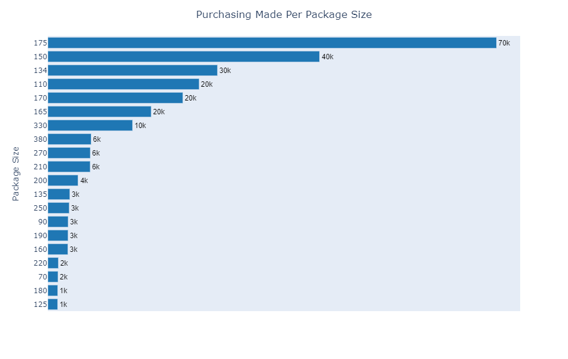
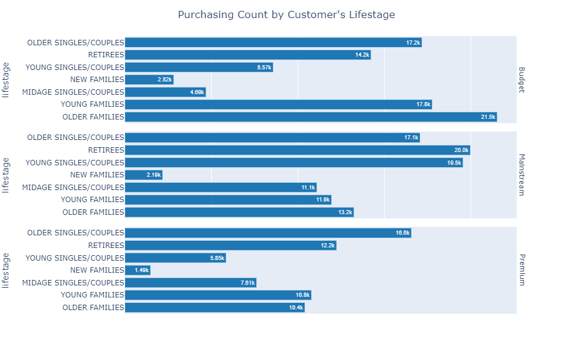
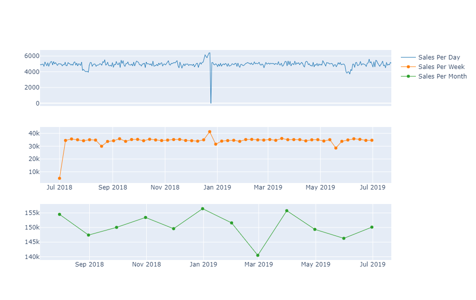
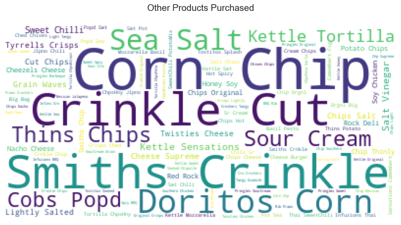

# About Quantium Virtual Experience Program

 <b>Quantium</b> has had a data partnership with a large supermarket brand for the last few years who provide transactional and customer data. You are an analyst within the Quantium analytics team and are responsible for delivering highly valued data analytics and insights to help the business make strategic decisions. 

Supermarkets will regularly change their store layouts, product selections, prices and promotions. This is to satisfy their customer’s changing needs and preferences, keep up with the increasing competition in the market or to capitalise on new opportunities. The Quantium analytics team are engaged in these processes to evaluate and analyse the performance of change and recommend whether it has been successful. 

Further details about the program can be assessed [here](https://www.theforage.com/virtual-internships/NkaC7knWtjSbi6aYv?ref=tCfFoXSNJ4aLnBQye)
 

- The program consists of 3 modules.
- The files in this repository are only my submitted files.

 

# Project Details

	
Problem Statement

	 
	
We need to present a strategic recommendation to Julia that is supported by data which she can then use for the upcoming category review. However, to do so we need to analyse the data to understand the current purchasing trends and behaviours. The client is particularly interested in customer segments and their chip purchasing behaviour. Consider what metrics would help describe the customers’ purchasing behaviour.
	

	
Project Goals

	 
	
In this project, I wanted to achieve 2 main goals and they are;

	<ol>
		<li>Segment dataset and draw unique insights, including visualization of customer segments and their chip purchasing behaviour.</li>
		<li>Evaluate the performance of a store trial which was performed in stores 77, 86 and 88.</li>
    <li>Provide Julia with insights and recommendations in the form of a report that she can use when developing the strategic plan for the next half.</li>
	</ol>

	
Information Needed

	 
	
I therefore needed the following data to help perform EDA and build my predictive model.

	<ul>
		<li><b>Customer data</b> - which should include characteristics of each customer, for example, age, education etc.</li>
		<li><b>Historical transaction data</b> – which should indicate every transaction the customer has performed.</li>
	</ul>

---

### Code and Resources Used
**Python Version:** 3.7\
**Packages:** Pandas, Numpy, Matplotlib, Datetime, Plotly, Seaborn, Wordcloud, Mlxtend, Statsmodel, Scipy, Bioinfokit

 

### Installing Packages

To run the jupyter notebook on your localhost, I recommend you install the packages I used for this project. You can do that by;

<ul>
	<li>Downloading the <i>requirements.txt</i> file and save it into the directory you'll be working from.</li>
	<li>Open anaconda prompt and navigate into the directory containing the file.</li>
	<li>Type <i>conda create --name env-name --file requirements.txt</i> where env-name is the environment name of your choice.</li>
	<li>Once your environment is created type <i>conda activate env-name</i> and then open jupyter notebook.</li>
</ul>

---

 

# Summary of Steps Taken

	
Data Quality Assessment

	 
	
The first task that I performed under the data preparation step was initial assessment of the quality of data which easily allowed me to           properly clean the data. The following were some of the issues discovered;

	<ul>
		<li>Discovered some columns will not be needed for the analysis.</li>
		<li>Some of the data types were not properly formatted including the date.</li>
    <li>Some column values needs tobe split.</li>
	</ul>

	
Data Cleaning and Preprocessing

	 
	
The preprocessing step (usually an iterative process) was carried out to clean the data based on data quality issues identified. Some of           the task performed in this step include;

	<ul>
		<li>Creating package size column</li>
		<li>Removing no chips products.</li>
		<li>Proper date formatting</li>
	</ul>

	
Exploratory Data Analysis

	 
	
One of the goals for this project as mentioned earlier was to segment dataset and draw unique insights, including visualization of customer segments and their chip purchasing behaviour.. Based on this stated goal, we will perform any set of anylysis of our data to obtain insights that can help us arrive at some plausible conclusions.
	

	
To achieve the first goal, I answered a few questions using both quantitative and graphical methods. Some of the questions are listed below.

	<ul>
		<li>What is the total number of purchases made per package size?</li>
		<li>How many purchases were made per customer valuation?</li>
		<li>Which product brand was purchased alot by the customers?</li>
		<li>What is the purchasing count per customer lifestage?</li>
		<li>How does the total sales vary for each customer lifestage?</li>
		<li>How does the total product quantity vary for each customer lifestage?</li>
		<li>Are most premium valuation customers young individuals?</li>
		<li>How did purchasing made by customers changed over time ( days, weeks)?</li>
		<li>How did purchsing per customer valuation changed over time?</li>
	</ul>
	  
	<h3>Sample Visualizations</h3>
	

		
		
	

	 
	

		
		
	

	

	
Statistical Analysis

	 
	
For this task, I performed ANOVA test to determine if the difference in average unit price between the various customer valuations are 		truly significant.

	<ul>
		<li>The p value obtained from ANOVA analysis is lesser than the alpha value(p < 0.05), and therefore, we conclude that there are significant differences in the 		mean unit price between the various customer valuations.</li>
		<li>Tukey’s HSD suggests that, two of the pairwise comparisons for customer valuations rejects null hypothesis (p < 0.05) and indicates statistical significant 		differences in mean unit price. However, due to the random sampling, we would expect to have one of the groups having p-value greater than 0.05 but we will 			still work with the overall p-value.</li>

</li>
	</ul>

	
Affinity Analysis

	 
	
Affinity analysis or Market basket analysis, is a data mining technique used to understand the purchase behavior of customers. That is, 		it largely involves the process of finding connections between different items based on the subject's view of these items. Affinity analysis is used for studying 		patterns and behavior in customers to determine links in purchases. Based on the analysis performed, I found out that
	

	<ul>
		<li>DORITOS and KETTLE have the highest support which means they appear the most in our association rule, even though they have a lift value 					below 1, it will be okay to keep them available for customers since cutsomers will likely go for the other as alternative.</li>
		<li>The lift values are well closer to 1 which could mean that customers see these brands as alternatives to each other and this is even clearer with the 			confidence values we are getting. The probability that the consequent will be purchased based on the antecedents is really low. If customers are seeing these 			brands as alternatives, then its clear that customers like to interchange between these seen brands.</li>
	</ul>
	

	
Experimentation and Uplifting

	 
	
For this part of the project we will be examining the performance in trial vs control stores to provide a recommendation for each 		location based on our insight. The followin insights were found;

	<ul>
		<li>Store 233 was found to be the best control store for trial store 77</li>
		<li>Store 155 was found to be the best control store for trial store 86</li>
		<li>Store 178 was found to be the best control store for trial store 88</li>
	</ul>

	
Summary of Results

	 
	<ul>
		<li>The results for trial stores 77 and 88 during the trial period show a significant difference in at least two of the three trial months but this is not the 			case for trial store 86.</li>
		<li>Stocks should be high in December before the Christmas</li>
		<li>Kettle, Smiths, Doritos and Pringles should be kept in stocks as they are the most sold</li>
		<li>Mainstream young singles/couples, retirees are the account for a great share of chips sale so they need much attention.</li>
		<li>Budget older families have the maximum contribution to sales.</li>
	</ul>

---

### Credential 
[Earned Certificate](https://insidesherpa.s3.amazonaws.com/completion-certificates/Quantium/NkaC7knWtjSbi6aYv_Quantium_tCfFoXSNJ4aLnBQye_1638375505087_completion_certificate.pdf)
